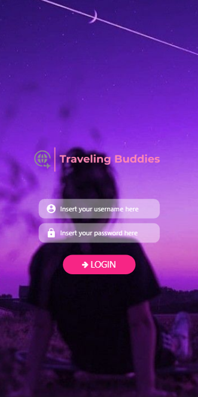

# Traveling Buddies :airplane:

Hey guys. In this repo we are just improving our React Native skills by trying to build an app.

## Table of Contents

- [Screenshots](#screenshots-camera)
- [To Do](#to-do-pushpin)
- [Install](#install-floppy_disk)
- [Usage](#usage-computer)
- [Notes](#notes-notebook)
- [Social Media](#social-media-bust_in_silhouette)

## Screenshots :camera:



## To Do :pushpin:

- [x] ~~Create Login Screen~~
- [x] ~~Create Home Screen~~
- [x] ~~Navigate between screens~~
- [x]  ̶C̶r̶e̶a̶t̶e̶ ̶a̶ ̶"̶S̶h̶o̶w̶ ̶P̶a̶s̶s̶w̶o̶r̶d̶"̶ ̶b̶u̶t̶t̶o̶n̶ ̶o̶n̶ ̶L̶o̶g̶i̶n̶ ̶S̶c̶r̶e̶e̶n̶
- [ ] Use Animations

* Note: this project is in progress, not finished yet

## Install :floppy_disk:

* Check if you have npm in your computer, and then install the dependencies using:

```
$npm install
```

## Usage :computer:

* To run this project in your device, you should first download Expo on Playstore or  Apple Store. Then, you should install expo in your computer using this command below:

```
$npm install -g expo-cli
```

* After that, you are able to run this project. After execute the command below, you can read the QR code or emulate it using your device

```
$npm start or $expo start
```

## Notes :notebook:

* Well, the project is not finished yet and we are using this to practice both our English and programming skills. So if you want to give us any tip or to make a constructive criticism, contact us in our social media

## Social Media :bust_in_silhouette:

* My name: Wesley Marques Pizetta
* E-mail: wesleypizetta@hotmail.com
* Linkedin: https://www.linkedin.com/in/wesley-pizetta-329606190/
