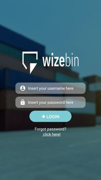
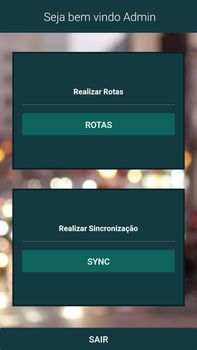

# Wizebin App :truck:

Hey guys. In this repo I am just improving my React Native skills by trying to build an app. I am also using Firebase to storage the data and to authenticate my users.

## Table of Contents

- [Screenshots](#screenshots-camera)
- [To Do](#to-do-pushpin)
- [Install](#install-floppy_disk)
- [Usage](#usage-computer)
- [Notes](#notes-notebook)
- [Social Media](#social-media-bust_in_silhouette)

## Screenshots :camera:




## To Do :pushpin:

- [x] ~~Create Login Screen~~
- [x] ~~Create Home Screen~~
- [ ] Create "Rotas" Screen
- [ ] Add an action to the "Sync" button
- [x] ~~Navigate between screens~~
- [ ] Implement Firebase auth
- [ ] Create a "Show Password" button on Login Screen
- [ ] Use Animations

* Note: this project is in progress, not finished yet

## Install :floppy_disk:

* Check if you have npm in your computer, and then install the dependencies using:

```
$npm install
```

## Usage :computer:

* To run this project in your device, you should first download Expo on Playstore or  Apple Store. Then, you should install expo in your computer using this command below:

```
$npm install -g expo-cli
```

* After that, you are able to run this project. After execute the command below, you can read the QR code or emulate it using your device

```
$npm start or $expo start
```

## Notes :notebook:

* Well, the project is not finished yet and I am using this to practice both my English and programming skills. So if you want to give me any tip or contact me to make a constructive criticism, contact me on my social media

## Social Media :bust_in_silhouette:

* My name: Wesley Marques Pizetta
* E-mail: wesleypizetta@hotmail.com
* Linkedin: https://www.linkedin.com/in/wesley-pizetta-329606190/
